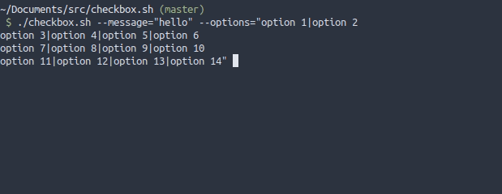
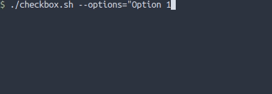
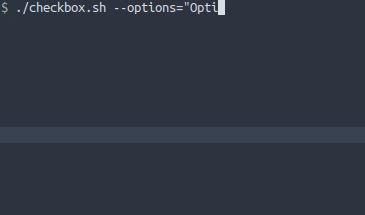
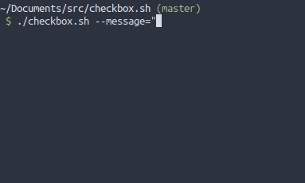
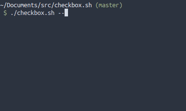
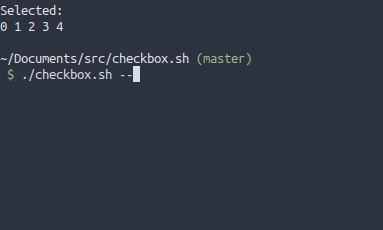
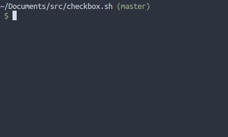
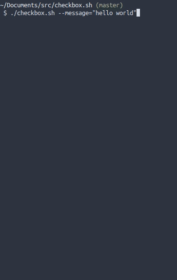
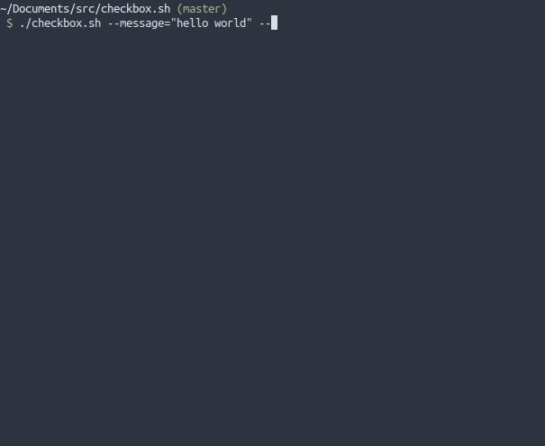

## ⌨️ checkbox.sh

 

Interactive checkboxes (menu) with pagination and vim keybinds for bash

  

### Table of Contents

- [ Features ](#features)
- [ Arguments Usage ](#arguments-usage)
- [ Keybinds Usage ](#keybinds-usage)
- [ Limitations ](#limitations)

 
 

### Features

- Select only a option or multiple options
- Select or unselect multiple options easily
- Select all or unselect all
- Pagination
- Optional Vim keybinds
- A .sh file with approximately 500 lines
- Start with options selected
- Show selected options counter for multiple options
- Show custom message
- Show current option index and options amount
- Copy current option value to clipboard
- Help tab when press h or wrongly call the script

 
 

### Arguments Usage

##### Checkbox options

Use the argument `--options=""`

You can add new options:

- With the character `|`

 

- With new line

 

- Mixed

 

To start with options selected, put `+` in first character of the option

- If the argument --multiple is missing, just the first option marked with + will start selected

 

Any of this ASCII signs `\a \b \c \e \f \n \r \t \v` in any part of options will be removed.

 

If --options"" is missing. Sample options will be loaded with 30 options.

 

---

##### Show message on header

Use the argument `--message=""`

You can customize message

- Using ANSI  
  Example: `--message="\e[2K\e[31mhello world"`
    
- Using ASCII `\a \b \c \e \f \n \r \t \v`  
  Example: `--message="hello\rworld"`

- Maybe the layout breaks, in this case, try to refresh (press `r`)

 

---

##### Select multiple options

Use the argument `--multiple`

 

---

##### Return index instead of values

Use the argument `--index`

 

### Keybinds Usage

##### Move arround

Press `[UP ARROW]` or `'k'` to move cursor to option above

Press `[UP DOWN]` or `'j'` to move cursor to option below

 

Press `[PAGE UP]` or `'d'` to move cursor 5 options above

Press `[PAGE DOWN]` or `'u'` to move cursor 5 options below

 

Press `[HOME]` or `'g'` to move cursor to first option

Press `[END]` or `'G'` to move cursor to last option

 

---

##### Select current option

Press `[SPACE]` or `x`

 

---

##### Close and return selected options

Press `[ENTER]` or `'o'`

 

---

##### Select or Unselect All (only with --multiple)

Press `'a'` to select all and `'A'` to unselect all

 

---

##### Select or Unselect Mode (only with --multiple)

Press `'v'` to turn on/off select mode `'V'` to turn on/off unselect mode

- If select mode is on. Cursor will be green and when you navigate the options will be selected

- If unselect mode is on. Cursor will be red and when you navigate the options will be unselected

 

---

##### Quit

Press `[ESC]` or `'q'`

 

---

##### Copy

Press `'c'` or `'y'` to copy current option

 

---

##### Refresh

Press `'r'` to refresh renderization

 

---

##### Help

Press `'h'` or call script with invalid argument, and a help page will appear

 
 

### Limitations

- The script uses the command 'clear'
- The script uses bash array
- Terminal must have +8 lines for the script works (except for customizations in --mesage="", maybe the layout breaks)
- The script don't have any test until now
